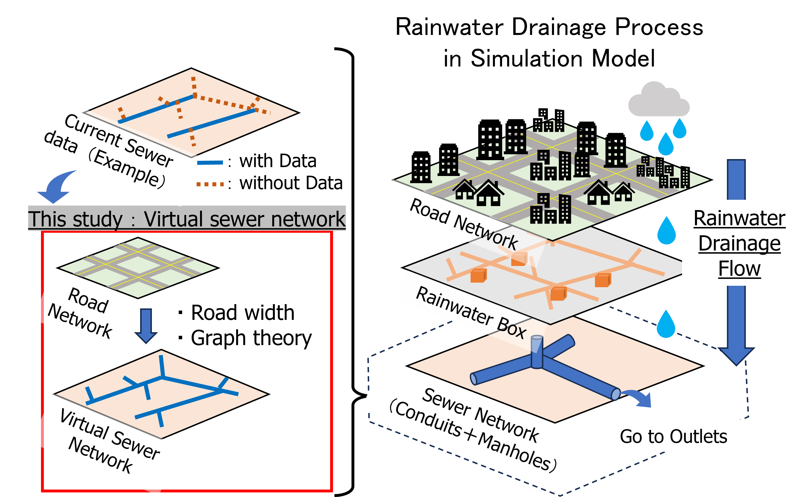
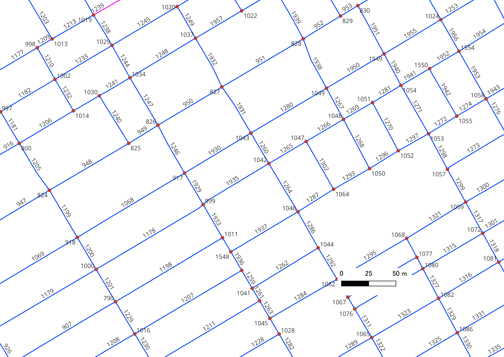

# Virtual-Sewer-Network
**このリポジトリでは仮想下水道網を構築します．仮想下水道網は主に道路網データを用いて構築します．**

# 仮想下水道網構築の構成要素
**デフォルトの手順**
1. QGIS上でネットワークを構築(Nodesレイヤ，Branchesレイヤを作成)
1. Nodesに管底高を付与
1. Branchesに管径を付与  
1. 解析の入力データの形式に整形

**グラフ理論を適用する場合の手順**
1. QGIS上でネットワークを構築(Nodesレイヤ，Branchesレイヤを作成)
1. ネットワークの最適化（グラフ理論を適用）
1. Nodesに管底高を付与
1. Branchesに管径を付与
1. 解析の入力データの形式に整形

# デフォルトの手順
## QGIS上でネットワークを構築
**道路ネットワークをレイヤに保存する**
1. 道路網データをダウンロードし，QGIS上の"Branches and Nodes"というツールを用いネットワークをそれぞれBranchesとNodesとして抽出する．この際必要に応じて，有料道路や幅員が小さい道路を削除する．

1. NodesにXY座標を付与し，DEMデータからZ座標も付与する．＜QGISの「ジオメトリ属性を追加」，「属性の最近傍結合」を使用＞
1. BranchesとNodesの接続情報（どのBranchesがどのNodesに繋がるか）をBranchesレイヤに格納する．＜QGIS上のPythonコンソールで"node_connect_branch_0416.py"を実行＞
1. Nodes.csv（xcoord, ycoord, z, Nodes_id）とBranches.csv（start_node_id, end_node_id, Branches_id, length）を出力

## Nodesに管底高を付与
1. QGIS上でポンプ場から同心円を作成し，Nodesレイヤとの重なりをレイヤに保存する．ここで作成する同心円は，[Branchesに管径を付与G](#branchesに管径を付与g)で示しているようにポンプ排水容量に応じたものである．結果的に領域内のポンプ場の数だけレイヤが作成される．
1. ポンプ場ごとのNodesレイヤに対して，各Nodesのポンプ場からの距離を計算し，マンホール深さを３ｍから５ｍの間で線形補完する＜QGIS上のpythonコンソールでsomepumptogether.py＞．
1. 同心円外にあるNodesに対して，規定値のマンホール深さを与える＜QGIS上のコンソールでsomepumptogether2.py＞
1. DEMで補間した各Nodesの地盤高からここまでで設定したマンホール深さを差し引くことで各Nodesに管底高を付与．ここで，各Nodesに対してどのレイヤに属するか（どのポンプ場を中心とした同心円に属するか）および属するレイヤの中心ポンプ場までの距離を格納したmh_data.csvと，各NodesのXY座標と管底高を格納したNodes.csvを出力する＜QGIS上で実施＞．

## Branchesに管径を付与
1. [QGIS上でネットワークを構築](#qgis上でネットワークを構築)において出力したBranches.csvのうち，lengthを除いたデータを格納しているsewer_data.csvと，mh_data.csvを入力データとして，ポンプ場からの距離に応じて管径を設定する＜kankei_set_dist.py＞．なお，このとき６００ｍｍから３０００ｍｍの間で線形補間し，同心円外にあるものに対しては６００ｍｍとする．このとき，sewer_diameters_with_distances.csvを出力する．

## 解析の入力データの形式に整形
1. nodes.csvとsewer_diameters_with_distances.csvを入力ファイルとして，NodeがいくつのBranchと接続しているかを集計し記録する＜nodeconnectbranch.py＞．
1. ＜nodeconnectbranch.py＞により出力したnode_with_connections.csvより，マンホールに関する解析用の入力データを作成する＜makemanhole.py＞．
1. sewer_diameters_with_distances.csvとmanhole_bshosei.datより，下水道に関する解析用の入力データを作成する＜makeconduit.py＞．

# グラフ理論を適用する場合の手順（Gと記載）
## QGIS上でネットワークを構築
**デフォルトの手順と同様**
## ネットワークの最適化（グラフ理論を適用）G
1. [Nodesに管底高を付与G](#nodesに管底高を付与g)でoutlet_idを付与したNodes.csvとBranches.csvを用意する．
1. Nodes.csvとBranches.csvを入力とし，グラフを作成（Kruskal's algorithm）し，排水先のポンプ場が最下流になるように向きを与える（幅探索法）＜makegraph.py＞．これらにより，向きがついたグラフである，Branch_directions.csvを得る．

## Nodesに管底高を付与G
1. それぞれのNodesに対し，排水先のポンプ場を距離ベースで割り当てる＜outletassign.py＞．これによりNodes.csvに格納されているNodes_idそれぞれに対して，outlet_idを対応させる．
1. Nodes.csvとBranch_directions.csvを入力データとして，管径を設定する＜setbottom.py＞．このときマンホール深さを，排水先のポンプ場が一番深くなるように３ｍから５ｍの間で線形補間する．

## Branchesに管径を付与G
**＜方法１＞：ポンプ場からの距離に応じた設定**
1. ＜makegraph.py＞により出力したfinal_used_nodes_directed.csv（各outletを始点とするグラフに属しているnodeを格納），とNodes.csvを入力ファイルとして，どのグラフに属するかの情報を統合＜nodes_filter.py＞．これによりfiltered_nodes.csvを出力する．
1. filtered_nodes.csvとBranch_directions.csvを入力ファイルとして，管径を設定＜diameter_set_AG.py＞．このとき，ポンプ場の距離に近いほど管径を大きくし６００ｍｍから３０００ｍｍの間で線形補間する．下図の通り処理区内に複数のポンプ場がある場合，各ポンプ場の排水容量に応じて同心円を形成し，その範囲内で６００ｍｍから３０００ｍｍを割り当てる．範囲外の場合は６００ｍｍとしている．

**＜方法２＞：簡易流入量に対応した設定**
1. ＜方法１＞同様に＜nodes_filter.py＞により，filtered_nodes.csvを出力する．
1. nodes.csv，branches.csv，Branch_directions.csvを入力ファイルとして，下図のようにそれぞれのBranchに簡易流入量（Local inflow）を設定し，下流に従い各Branchの流入量を合算し最終的な各Branchを流下する流量（Total inflow）を算出する＜length_inflow.py＞
1. ＜length_inflow.py＞により出力したBranches_with_flow.csvを入力ファイルとして，Total flowと管径を対応づける＜flow_to_diameter.py＞．このとき，方法１と同様に６００ｍｍから３０００ｍｍの間で線形補間している．

## 解析の入力データの形式に整形
1. [Nodesに管底高を付与G](#nodesに管底高を付与g)の＜setbottom.py＞において出力したnode_with_invert.csvと，[Branchesに管径を付与G](#branchesに管径を付与g)の＜diameter_set_AG.pyもしくはflow_to_diameter.py＞において出力したBranches_with_diameter.csvを入力ファイルとして，NodeがいくつのBranchと接続しているかを集計し記録する＜nodeconnectbranch.py＞．
1. ＜nodeconnectbranch.py＞により出力したnode_with_connections.csvより，マンホールに関する解析用の入力データを作成する＜makemanhole.py＞．
1. Branches_with_diameter.csv，Branch_directions.csv，manhole_bshosei.datより，下水道に関する解析用の入力データを作成する＜makeconduit.py＞